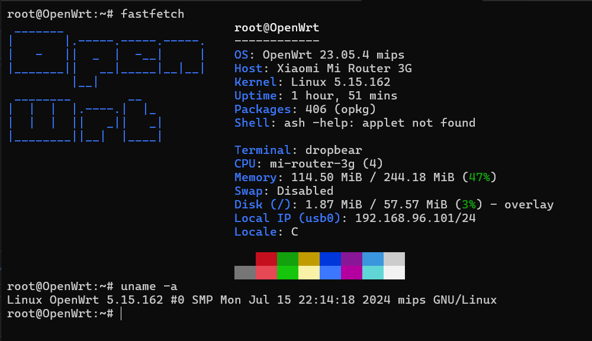
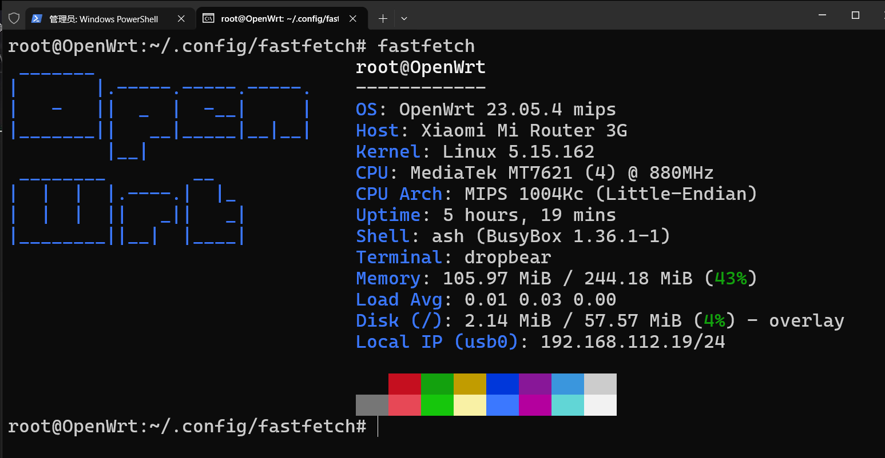

# Fastfetch for MiWiFi R3G (MT7621)

[](https://github.com/VincentZyu233/fastfetch_ForMiWifiRouter3G)
[](https://gitee.com/vincent-zyu/fastfetch_ForMiWifiRouter3G)

> 本仓库是fastfetch的fork捏，给**小米路由器 R3G (MIPS MT7621)**.设备提供预编译二进制捏
>
> **关键点:**
> * 🚀 **自动构建:** 使用 GitHub Actions.
> * 📦 **预构建二进制:** 可以直接在[Releases](../../releases) 里面下载捏.

## 快速一键安装
```bash
# 从 github 安装
wget -O - https://github.com/VincentZyu233/fastfetch_ForMiWifiRouter3G/raw/dev/doc/download_fastfetch_github.sh | sh
# 从 gitee 安装
wget -O - https://gitee.com/vincent-zyu/fastfetch_ForMiWifiRouter3G/raw/dev/doc/download_fastfetch_gitee.sh | sh
```




## github 的讨论捏:
> https://github.com/fastfetch-cli/fastfetch/discussions/2271

## 编译的流程捏
```bash
proxychains4 wget https://downloads.openwrt.org/releases/23.05.4/targets/ramips/mt7621/openwrt-sdk-23.05.4-ramips-mt7621_gcc-12.3.0_musl.Linux-x86_64.tar.xz
# 或者从清华tuna源下载呢：
wget https://mirrors.tuna.tsinghua.edu.cn/openwrt/releases/23.05.4/targets/ramips/mt7621/openwrt-sdk-23.05.4-ramips-mt7621_gcc-12.3.0_musl.Linux-x86_64.tar.xz

tar -xJf openwrt-sdk-23.05.4-ramips-mt7621_gcc-12.3.0_musl.Linux-x86_64.tar.xz
cd openwrt-sdk-23.05.4-ramips-mt7621_gcc-12.3.0_musl.Linux-x86_64
# cd /home/mac/SSoftwareFiles/openwrt-sdk/openwrt-sdk-23.05.4-ramips-mt7621_gcc-12.3.0_musl.Linux-x86_64
ls
pwd
# 找到工具链的目录捏
export SDK_PATH=$(pwd)
export TOOLCHAIN_PATH=$SDK_PATH/staging_dir/toolchain-mipsel_24kc_gcc-12.3.0_musl
export PATH=$TOOLCHAIN_PATH/bin:$PATH
export STAGING_DIR=$SDK_PATH/staging_dir
export SYSROOT=$SDK_PATH/staging_dir/toolchain-mipsel_24kc_gcc-12.3.0_musl

cd ..
proxychains4 git clone https://github.com/fastfetch-cli/fastfetch
cd fastfetch
# cd /home/mac/SSoftwareFiles/fastfetch
ls
pwd
mkdir build_mips && cd build_mips
rm -rf ./*

cmake .. \
  -DCMAKE_SYSTEM_NAME=Linux \
  -DCMAKE_SYSTEM_PROCESSOR=mips \
  -DCMAKE_C_COMPILER=mipsel-openwrt-linux-gcc \
  -DCMAKE_CXX_COMPILER=mipsel-openwrt-linux-g++ \
  -DCMAKE_STAGING_PREFIX=$SDK_PATH/staging_dir/target-mipsel_24kc_musl \
  -DCMAKE_FIND_ROOT_PATH=$SYSROOT \
  -DCMAKE_FIND_ROOT_PATH_MODE_PROGRAM=NEVER \
  -DCMAKE_FIND_ROOT_PATH_MODE_LIBRARY=ONLY \
  -DCMAKE_FIND_ROOT_PATH_MODE_INCLUDE=ONLY \
  -DCMAKE_EXE_LINKER_FLAGS="-static" \
  -DCMAKE_C_FLAGS="--sysroot=$SYSROOT -msoft-float -mips32r2 -nostdinc -I$SYSROOT/include -I$SYSROOT/usr/include" \
  -DENABLE_ZLIB=OFF \
  -DENABLE_DRM=OFF -DENABLE_X11=OFF -DENABLE_WAYLAND=OFF -DENABLE_VULKAN=OFF -DENABLE_DBUS=OFF -DENABLE_PCI=OFF

make -j$(nproc)

# 瘦身捏
ls -lh ./fastfetch
mipsel-linux-gnu-strip ./fastfetch
ls -lh ./fastfetch


cp ./fastfetch ./fastfetch-linux-mipsel

scp ./fastfetch-linux-mipsel root@192.168.5.1:/usr/bin/fastfetch
```

## 在OpenWrt修改Fastfetch的配置文件捏
```bash
nano ~/.config/fastfetch/config.jsonc
```
```json
{
    "$schema": "https://gitee.com/vincent-zyu/fastfetch_ForMiWifiRouter3G/raw/dev/doc/json_schema.json",
    "modules": [
        "title",
        "separator",
        "os",
        "host",
        "kernel",
        {
            "type": "cpu",
            "format": "MediaTek MT7621 (4) @ 880MHz"
        },
        {
            "type": "command",
            "key": "CPU Arch",
            "text": "echo 'MIPS 1004Kc (Little-Endian)'"
        },
        "uptime",
        {
            "type": "command",
            "key": "Shell",
            "text": "echo \"ash (BusyBox $(opkg status busybox | grep Version | awk '{print $2}'))\""
        },
        "terminal",
        "memory",
        {
            "type": "command",
            "key": "Load Avg",
            "text": "cat /proc/loadavg | awk '{print $1, $2, $3}'"
        },
        "disk",
        "localip",
        "break",
        "colors"
    ]
}
```

## 最终效果




---
> 以下是来自原始上游仓库的README:


[](https://github.com/fastfetch-cli/fastfetch/actions)
[](https://github.com/fastfetch-cli/fastfetch/blob/dev/LICENSE)
[](https://github.com/fastfetch-cli/fastfetch/graphs/contributors)
[](https://github.com/fastfetch-cli/fastfetch/blob/dev/CMakeLists.txt#L5)
[](https://github.com/fastfetch-cli/fastfetch/commits)  
[](https://formulae.brew.sh/formula/fastfetch#default)
[](https://github.com/fastfetch-cli/fastfetch/releases)  
[](https://github.com/fastfetch-cli/fastfetch/releases)
[](https://repology.org/project/fastfetch/versions)
[](https://repology.org/project/fastfetch/versions)
[](https://deepwiki.com/fastfetch-cli/fastfetch)
[](README-cn.md)

Fastfetch 是一款类似 neofetch 的系统信息展示工具，主要用 C 编写，强调性能和可定制性。支持 Linux、macOS、Windows 7+、Android、FreeBSD、OpenBSD、NetBSD、DragonFly、Haiku、SunOS。

示例配置见 presets/examples，更多截图与平台说明见 Wiki。

## 安装

Linux（部分）：
- Debian 13+ / Ubuntu: apt install fastfetch
- Arch: pacman -S fastfetch
- Fedora: dnf install fastfetch
- openSUSE: zypper install fastfetch
- Linuxbrew：brew install fastfetch
- 各发行版打包状态：https://repology.org/project/fastfetch/versions

macOS：
- Homebrew：brew install fastfetch
- MacPorts：sudo port install fastfetch

Windows：
- scoop install fastfetch
- choco install fastfetch
- winget install fastfetch
- MSYS2：pacman -S mingw-w64-<subsystem>-<arch>-fastfetch

BSD：
- FreeBSD：pkg install fastfetch
- NetBSD：pkgin in fastfetch
- OpenBSD：pkg_add fastfetch

Android（Termux）：
- pkg install fastfetch

Nightly 构建：
- https://nightly.link/fastfetch-cli/fastfetch/workflows/ci/dev?preview

## 源码构建

基本上是 `cmake . && make`。详见 Wiki：https://github.com/fastfetch-cli/fastfetch/wiki/Building

## 使用

- 默认运行：`fastfetch`
- 查看所有可用模块示例：`fastfetch -c all.jsonc`
- 以 JSON 输出指定模块：`fastfetch -s <module1>[:<module2>] --format json`
- 完整命令行帮助：`fastfetch --help`
- 生成最小配置：`fastfetch --gen-config [</path/to/config.jsonc>]`
  - 生成完整配置：`fastfetch --gen-config-full`
  - 请使用支持 JSON schema 的编辑器（如 VSCode）编辑配置文件！
  - 如果你连接 Github 有网络困难（智能提示不生效），可将配置文件中的 `$schema` 的值替换为 `https://gitee.com/carterl/fastfetch/raw/dev/doc/json_schema.json`

## 定制

- 配置使用 JSONC，语法与选项见 Wiki：https://github.com/fastfetch-cli/fastfetch/wiki/Configuration
- 预设示例位于 presets，可用 `-c <filename>` 加载
- Logo 选项与图像显示见文档：https://github.com/fastfetch-cli/fastfetch/wiki/Logo-options
- 模块格式化（示例，仅显示 GPU 名称）：
```jsonc
{
  "modules": [
    { "type": "gpu", "format": "{name}" }
  ]
}
```
详见：https://github.com/fastfetch-cli/fastfetch/wiki/Format-String-Guide

## 反馈与支持

- 使用问题：Discussions https://github.com/fastfetch-cli/fastfetch/discussions
- 疑似缺陷：Issues https://github.com/fastfetch-cli/fastfetch/issues（请填写模版）

## 赞助


